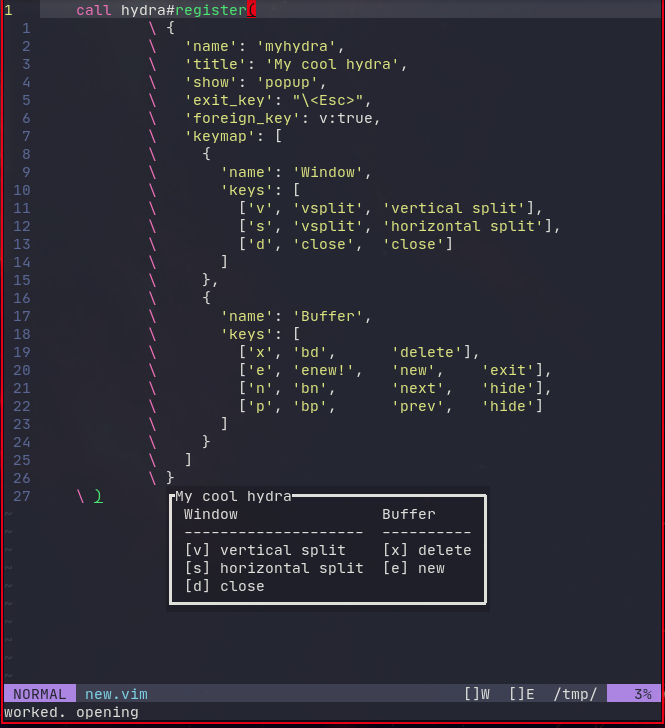

# vim-hydra plugin (experimental)

## About

This plugin allows you to create hydras similar to abo-abo's Emacs plugin.
This is still a demo project.



## Installation

Using vim-plug

```vim
    Plug 'brenopacheco/vim-hydra',
```

Or use your preferred plugin manager.

## Create hydras

Create a dict with your hydra's configuration and call hydra#hydras#register(...).

```vim
    hydra#hydras#register(
            \ {
            \   'name': 'myhydra',
            \   'title': 'My cool hydra',
            \   'show': 'popup',
            \   'exit_key': "\<Esc>",
            \   'foreign_key': v:true,
            \   'keymap': [
            \     {
            \       'name': 'Window',
            \       'keys': [
            \         ['v', 'vsplit', 'vertical split'],
            \         ['s', 'vsplit', 'horizontal split'],
            \         ['d', 'close',  'close']
            \       ]
            \     },
            \     {
            \       'name': 'Buffer',
            \       'keys': [
            \         ['x', 'bd',      'delete'],
            \         ['e', 'enew!',   'new',    'exit'],
            \         ['n', 'bn',      'next',   'hide'],
            \         ['p', 'bp',      'prev',   'hide']
            \       ]
            \     }
            \   ]
            \ }
    \ )
```

The name and title fields are required.

### hydra-show

The show option tells how the hydra is displayed. Currently, only bottom split
and popup are available. the popup (floating window) will only work with neovim.

Default: "popup"

### hydra-foreign_key

The foreign_key options tells whether the hydra remains open or
closes if the user presses some key he has not defined in the keymap.
If v:true, the hydra remains open.

Default:
v:true

### hydra-exit_key

The exit_key option tells which key to use for closing the hydra.
This key is set hidden in the keymap.

Default:
"\<Esc>"

### hydra-keymap-exit

Keys in the keymap defined with a "exit" value will exit the hydra
after the command is run.

### hydra-keymap-hide

Keys in the keymap defined with a "hide" value will not be displayed
in the hydra.

## Usage

The plugin exposes the |:Hydra| command, which takes the hydra name as argument
and opens the hydra.

```vim
    :Hydra myhydra
```

### Options

Default values for generating hydras.

```vim
g:hydra_defaults = {
            \ "show":        'popup',
            \ "foreign_key": v:true,
            \ "exit_key":    "q",
            \ }
```

## API

- hydra#hydras#register(): Register hydra. Takes hydra dict as argument.
- hydra#hydras#list(): Returns a list of registered hydras.
- hydra#hydras#open(): Opens an hydra by name.
- hydra#hydras#get(): Get an hydra object (dict) by name.
